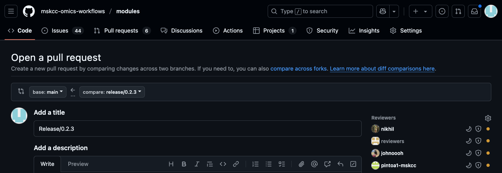

<!--
# mskcc-omics-workflows/modules release

Many thanks for contributing to mskcc-omics-workflows/modules!

Please follow the steps below for making a release.

Remember that PRs should be made against the main branch.

Learn more about contributing: [gitbook](https://mskcc-omics-workflows.gitbook.io/omics-wf/GMaCKqX0TmAhUOoZmuc6)
-->


# Release Procedure

This document outlines the steps for creating and publishing a new release.

## 1. Make Release Branch from develop

```
git checkout -b release/X.Y.Z develop
```

Versioning:
- `MAJOR`: major bump decided upon by review team
- `MINOR`: additional functionality added from nf-core/modules like new git-actions, schemas, etc
- `PATCH`: added modules

```
git push origin release/X.Y.Z
```

## 2. Create a PR to main



## 3. Pre-Release Checklist

- [ ] Compare `.github/workflows/nf-test.yml` against nf-core's [`nf-test.yml`](https://github.com/nf-core/modules/blob/198f39a55453b855cfa3b88a0cf7f68981540ca7/.github/workflows/nf-test.yml):
    - [ ] Check if `NXF_VER` has changed, and update.
    - [ ] Look for added sections and other larger changes. This my require examining nf-core's [`.github` directory](https://github.com/nf-core/modules/tree/198f39a55453b855cfa3b88a0cf7f68981540ca7/.github)
        - suggested comparison:
          ```console
          wget https://raw.githubusercontent.com/nf-core/modules/198f39a55453b855cfa3b88a0cf7f68981540ca7/.github/workflows/nf-test.yml -O nf-test-nf.yml
          diff nf-test-nf.yml ./.github/workflows/nf-test.yml
          ```
    - [ ] Update develop and release branch with changes if necessary
- [ ] merge in changes from main:
- [ ] All relevant issues/PRs are merged
- [ ] All CI tests are passing
- [ ] Code is linted and formatted

Along with the check-list, you will also need approval from a member of the reviewers team.

## 4. Post-Merge

