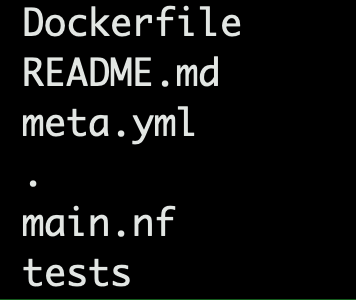

# How to start a new module on our own

#### Steps

1. brew install poetry (or using pip)
2. git clone [https://github.com/mskcc-omics-workflows/tools.git](https://github.com/mskcc-omics-workflows/tools.git)
3. cd tools
4. git checkout -b feature/\<your-module-name>
5. poetry install
6. poetry run make module
7. provide necessary information for the module
8. you will be able to find your module in `modules` directory

#### Content

The `main.nf` script is the main one that we write the module;

`meta.yml` is used to record inputs and outputs of the module;

